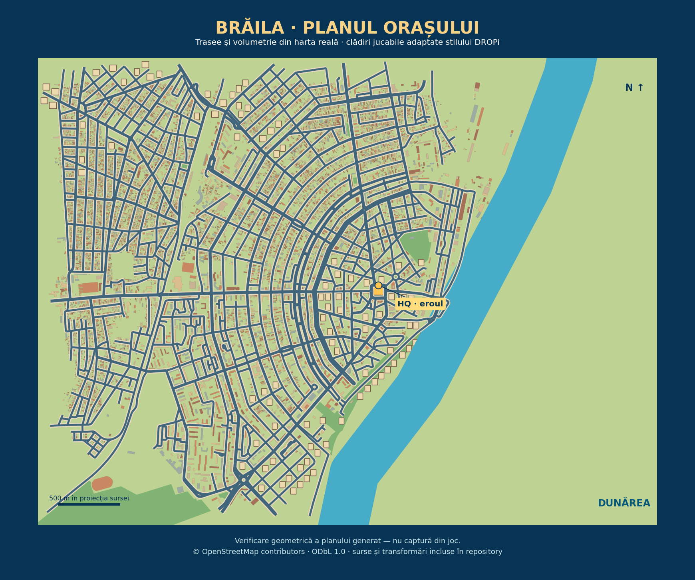

# Brăila visual map and semantic zoom — #535

Status: implementation prepared for review; no auto-merge or deployment initiated.
Related: #491, #492, #493, #317 and Owner Directives 004–006.

## Result

The city is now a Brăila-inspired central-city plan: 582 connected source street runs, 10582 context building footprints, 95 playable building placements and 29 retained delivery locations. Source Danube/park geometry and game-styled roof massing make the real urban structure visible from above. Existing dimensional shops, hero, NPCs, trees and vehicle art remain in use at street scale.

The local camera covers hero/area/district/city. Zooming outward connects to Brăila County, Sud-Est, Romania and wider geographic views. The map removes the old eight-times zoom cap and adds bounded relief/water layers, lazily discovered regional locality data, fixed-size geographic labels and gesture cleanup. World inspection sleeps/wakes the city instead of rebuilding economic/player state. The entry scene remains the Brăila pilot; other locality plans remain pending.

The figure is a geometry review generated from the same source layout, not a runtime screenshot. Reproduce it with `python scripts/render_city_plan_review.py` (matplotlib).

## Verification

- Rebased onto the concurrent country rollout at `1335ab9` without changing its country configs, generators or catalogs.
- Node 22.20 TypeScript check and production Vite build pass.
- Full local Vitest result: **1164 passed, 0 failed, 9 skipped** (1173 total). Skipped cases are existing optional PostgreSQL integration checks.
- All source graph nodes connect to HQ; every playable door has a collision-checked access path. Walking schedules retain all eight merchants and twenty-one customers. Legacy first-order templates, merchant/customer identities, company progression and Save v2 behavior remain covered.
- Zoom focal invariance, Android viewport fit, label suppression, regional capital reconciliation, source checksums, rotated crossing behavior and terrain/detail budgets are covered.
- City overview is capped at 1536 pixels; detailed ground at twelve 768-pixel textures (27 MiB), one generated tile per frame. Detail is released when the city sleeps. Geographic relief uses at most six 1080-pixel detail tiles and two concurrent requests.
- The production bundle is about 4.05 MB / 1.06 MB gzip; Vite's large-chunk advisory remains. Runtime performance on the target Android device has not been measured.

## Visible review still required

The browser inspected the existing Railway game and the real Brăila map. The available cloud browser could not open the local preview (`ERR_BLOCKED_BY_CLIENT`), so this work does not claim new-runtime screenshot validation or Android acceptance. The generated geometry figure was rendered and inspected.

Owner review should follow the whole route: open World map, select Romania, explore deeper regional places, focus Brăila, enter the city, zoom through district/area/hero, return outward to county/region/country/world, then resume an active pickup/delivery. Check pinch, wheel and buttons, text overlap at landscape Android size, building/street readability, smoothness after tile loading, and cargo/hero continuity. Long source-status descriptions in the country panel can be scrolled.

#317 forbids auto-merging visible PRs. Its Android/Railway checkpoint remains the owner acceptance gate.

## Remaining worldwide work

`CITY_PLAN_POLICY.json` records the owner's capital + four major + four smaller starting-node target and real-map requirements for capitals/major cities. Brăila is the first playable pilot, not evidence that every city has been produced. Regional locality ingestion continues independently.

The physical map is not a resource-stock inventory. Global/country/region quantities, productive facilities and transport capacity still require their own source ingestion under #493/#492. Required measurement distinctions and provenance fields are recorded in `04_World/Physical_Geography/README.md`.
